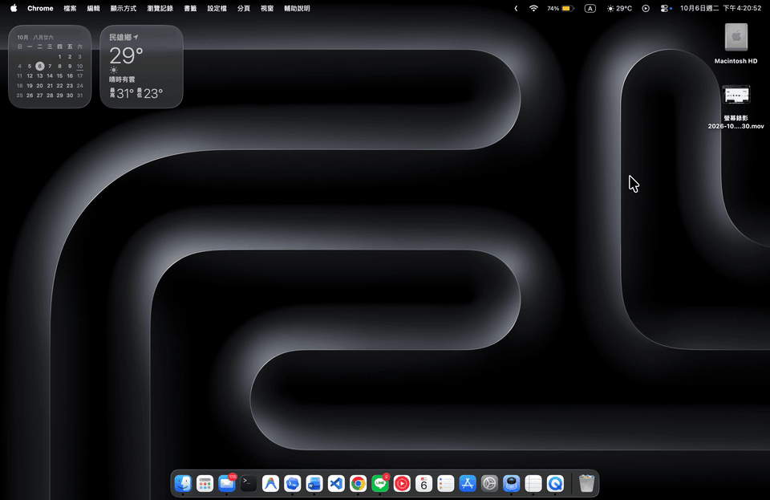
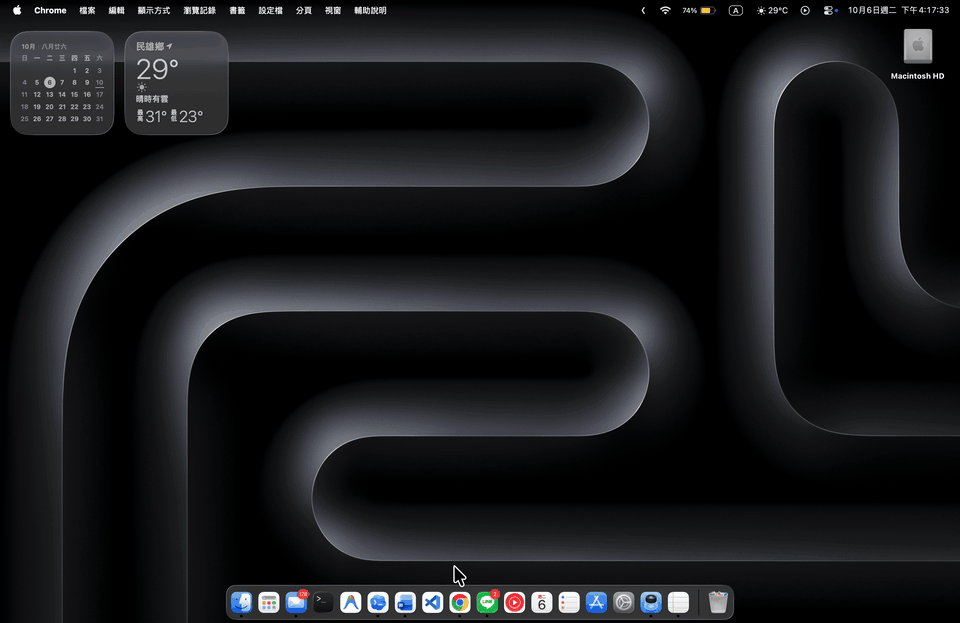
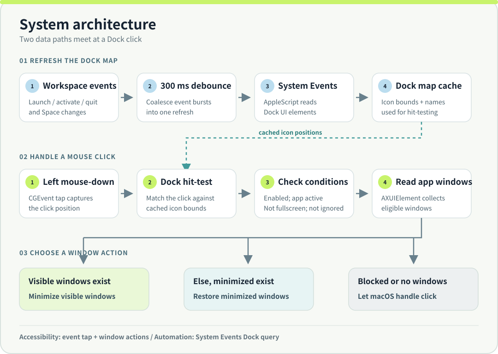

<p align="center"><strong>English</strong> · <a href="README.zh-TW.md">繁體中文</a></p>

<p align="center">
  <picture>
    <source media="(prefers-color-scheme: dark)" srcset="assets/hero-banner-dark.svg">
    
  </picture>
</p>

<p align="center"><strong>Click an active app's Dock icon to minimize its windows. Click again to restore them.</strong><br>
Click2Minimize adds a window toggle to the macOS Dock while leaving ordinary app launching and switching to macOS.</p>

<p align="center">macOS 13+ · Swift 5 · Build with Xcode 15+ · <a href="LICENSE">PolyForm Noncommercial 1.0.0</a></p>

<p align="center"><small>Based on <a href="https://github.com/hatimhtm/Click2Minimize">Click2Minimize by Hatim El Hassak</a>.</small></p>

## See the difference

### Before · Default macOS Dock

Clicking Chrome's Dock icon while Chrome is already in front leaves its window open.



### After · Click2Minimize

Clicking the same Dock icon toggles the window between restored and minimized. In this recording, the first click restores Chrome and the next minimizes it.



| When you click an app's Dock icon | Default macOS | With Click2Minimize |
| --- | --- | --- |
| App is closed or in the background | Launches or activates the app | Same macOS behavior |
| App is active with visible windows | Keeps the app in front | **Minimizes its eligible visible windows** |
| App is active with only minimized windows | Normal Dock behavior | **Restores its eligible minimized windows** |
| Frontmost app has a fullscreen window | Normal Dock behavior | Same macOS behavior |

## How it works

macOS handles the first click that launches or activates an app. Click2Minimize acts only when you click the Dock icon of an app that is already active:

**Open or switch (macOS) → Minimize visible windows → Restore minimized windows**

If an app has both visible and minimized windows, the visible ones take priority. The next click restores eligible minimized windows, including windows you minimized manually.

## Get started

Build this fork locally:

```bash
git clone https://github.com/chengen1018/Click2Minimize.git
cd Click2Minimize
xcodebuild -project Click2Minimize.xcodeproj -scheme Click2Minimize \
  -configuration Release -derivedDataPath build
```

The app will be at `build/Build/Products/Release/Click2Minimize.app`. Move it to Applications if you want, then launch it. To build an ad-hoc signed universal DMG at `dist/Click2Minimize.dmg`, run `./build_dmg.sh` instead.

### Permissions

1. In **System Settings → Privacy & Security → Accessibility**, allow Click2Minimize. Relaunch the app after granting access.
2. When macOS asks, allow **Automation → System Events** so the app can read Dock icon names and positions.
3. Use the menu bar icon to enable or disable the toggle, or turn on **Launch at login**. The toggle is on by default and launch at login is off by default.

> A locally built, ad-hoc signed app may require **Open** from Finder's context menu on first launch.

## Behavior and limitations

- Clicks on Launchpad, Trash, and Downloads keep their normal macOS behavior.
- When the frontmost app has a fullscreen window, Click2Minimize passes the click through to macOS.
- Finder toggling applies only to standard Finder windows.
- Apps that do not expose their windows through macOS Accessibility may not respond.

## Why this fork?

This fork focuses on predictable Dock toggling across multi-window apps, manually minimized windows, and Finder:

- **Current-window-state decisions:** Visible windows are minimized first. When none are visible, all eligible minimized windows are restored, even if Click2Minimize did not minimize them.
- **Finder filtering:** Only standard Finder windows are changed.
- **Sequential multi-window handling:** Window actions run one at a time to accommodate apps whose Accessibility window lists update asynchronously.

See [CHANGELOG.md](CHANGELOG.md) for the change history.

## Architecture

<p align="center"></p>

The two paths meet at the cached Dock map:

- **Refresh:** `NSWorkspace` launch, activation, termination, and Space changes are debounced for 300 ms. AppleScript asks System Events for Dock item names and bounds.
- **Click:** a `CGEvent` tap sees left mouse-down events. The handler matches the click to a cached Dock item, then checks whether the feature is enabled, the app is active, and the frontmost app is not fullscreen.
- **Window action:** `AXUIElement` reads the app's windows. Visible windows take priority and are minimized; when none are visible, minimized windows are restored. If no action applies, the original click passes through.

The current startup path does not invoke the update-check functions. Dock discovery depends on macOS Accessibility and System Events permissions. Local tests for the window-action decision are in [`Tests/WindowToggleDecisionTests.swift`](Tests/WindowToggleDecisionTests.swift).

## Origin and license

The original project is [Click2Minimize by Hatim El Hassak](https://github.com/hatimhtm/Click2Minimize). This repository is a derivative, not an independent rewrite. The original work and derivative portions remain subject to the [PolyForm Noncommercial 1.0.0 license](LICENSE). Read [NOTICE.md](NOTICE.md) and [LICENSE](LICENSE) before redistributing or adapting the project.
