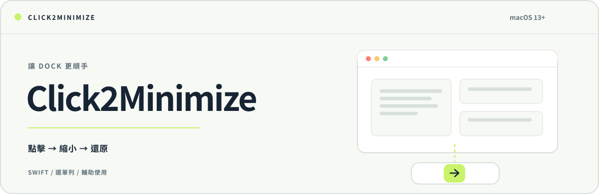
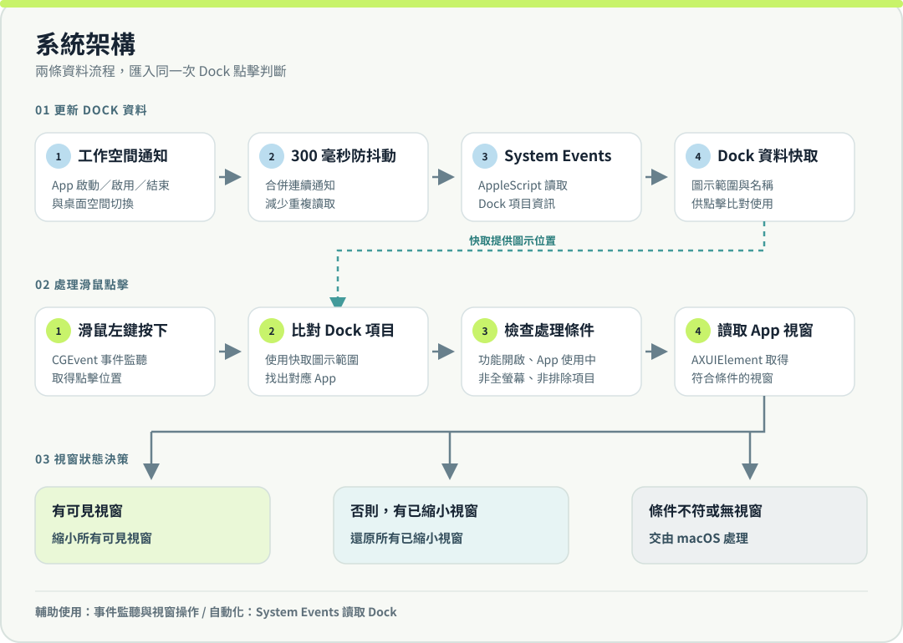

<p align="center"><a href="README.md">English</a> · <strong>繁體中文</strong></p>

<p align="center">
  <picture>
    <source media="(prefers-color-scheme: dark)" srcset="assets/hero-banner-zh-TW-dark.svg">
    
  </picture>
</p>

<p align="center"><strong>點一下 Dock 圖示，讓視窗暫時退到一旁。</strong><br>
Click2Minimize 是一款輕巧的 macOS 選單列工具，讓目前使用中 App 的 Dock 圖示成為縮小與還原視窗的開關。</p>

<p align="center">macOS 13+ · Swift 5 · Xcode 15+ 建置 · <a href="LICENSE">PolyForm Noncommercial 1.0.0</a></p>

> **關於這個衍生版本：**本專案以 [Hatim El Hassak 的 Click2Minimize](https://github.com/hatimhtm/Click2Minimize) 為基礎，由 Chengen 維護。請參閱[本版本的改動](#本版本的改動)、[NOTICE.md](NOTICE.md) 與[授權條款](LICENSE)。

## 點擊後會發生什麼事？

| 點擊的 Dock 項目 | 結果 |
| --- | --- |
| 目前使用中的 App，且有可見視窗 | 將符合條件的可見視窗縮到最小。 |
| 目前使用中的 App，沒有可見視窗但有已縮小視窗 | 還原符合條件的已縮小視窗，包括先前手動縮小的視窗。 |
| 其他 App、Launchpad／垃圾桶／下載項目，或最前方 App 處於全螢幕 | 由 macOS 照原本方式處理點擊。 |

切換依據是 App 當下的視窗狀態；程式不另外記錄哪些視窗是由自己縮小的。對 Finder，程式只處理標準 Finder 視窗。若某個 App 沒有透過 macOS「輔助使用」公開視窗，則可能無法操作。

## 開始使用

此衍生版本目前**沒有可下載的 Release**，請在本機建置：

```bash
git clone https://github.com/chengen1018/Click2Minimize.git
cd Click2Minimize
xcodebuild -project Click2Minimize.xcodeproj -scheme Click2Minimize \
  -configuration Release -derivedDataPath build
```

App 位於 `build/Build/Products/Release/Click2Minimize.app`。可以將它移到「應用程式」資料夾後啟動。若要建立臨時簽署的通用架構 DMG，改執行 `./build_dmg.sh`，輸出會位於 `dist/Click2Minimize.dmg`。

1. 到「**系統設定 → 隱私權與安全性 → 輔助使用**」允許 Click2Minimize，授權後重新啟動 App。
2. macOS 詢問時，允許「**自動化 → System Events**」，讓程式讀取 Dock 圖示的名稱與位置。
3. 從選單列圖示開啟設定，可以開關此功能或啟用「**登入時啟動**」。預設會啟用縮小／還原功能，登入時啟動則預設關閉。

> 本機建置並以臨時憑證簽署的 App，首次啟動時可能需要在 Finder 中按右鍵選擇「打開」。

## 架構與運作流程

<p align="center"></p>

兩條流程透過快取的 Dock 資料銜接：

- **更新 Dock 資料：**`NSWorkspace` 的 App 啟動、啟用、結束與空間切換通知，經過 300 毫秒防抖動後，以 AppleScript 向 System Events 讀取 Dock 項目名稱與範圍。
- **處理點擊：**`CGEvent` 事件監聽取得滑鼠左鍵按下事件，比對快取的 Dock 項目，再檢查功能是否啟用、App 是否正在使用中，以及最前方 App 是否處於全螢幕。
- **操作視窗：**`AXUIElement` 讀取 App 視窗。只要有可見視窗，就優先縮小；若沒有可見視窗，則還原已縮小視窗。無需操作時，將原點擊交還 macOS。

目前的啟動流程不會呼叫更新檢查函式。讀取 Dock 資料需仰賴 macOS 的「輔助使用」與「自動化」權限。

## 本版本的改動

- 優先縮小可見視窗；再點擊時，會還原所有符合條件的已縮小視窗，包括先前手動縮小的視窗。
- Finder 只處理標準 Finder 視窗。
- 依序操作多個視窗，以配合輔助使用視窗清單可能非同步更新的 App。
- 加入視窗操作判斷的本機測試。變更記錄請參閱 [CHANGELOG.md](CHANGELOG.md)。

## 專案來源與授權

原始專案是 [Hatim El Hassak 的 Click2Minimize](https://github.com/hatimhtm/Click2Minimize)。本儲存庫是以它為基礎的衍生作品，並非獨立從零實作。原始作品及衍生部分仍受 [PolyForm Noncommercial 1.0.0](LICENSE) 授權條款規範。重新散布或修改專案前，請閱讀 [NOTICE.md](NOTICE.md) 與 [LICENSE](LICENSE)。
